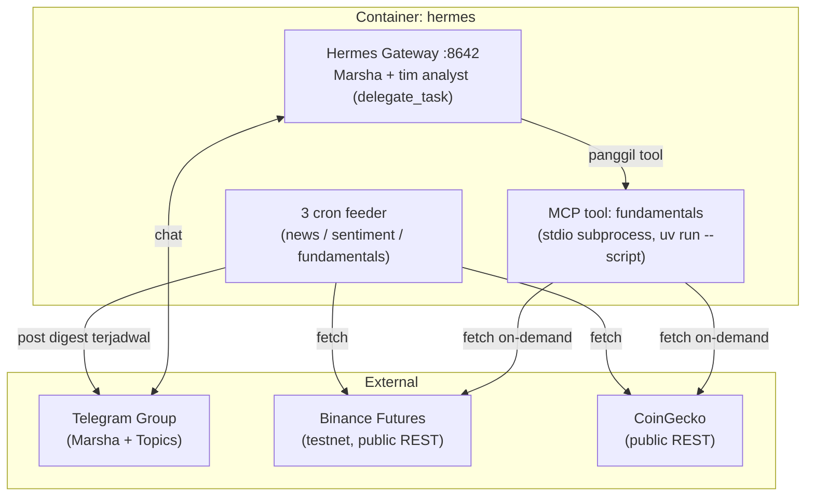

# marsha-agent

Asisten trading **crypto perpetual** berbasis AI. **Marsha** — satu AI orchestrator (bukan tim bot terpisah) — melakukan *reasoning*: analisis fundamental/teknikal/sentimen/berita, riset, dan keputusan risiko. Eksekusi trade nyata (engine deterministik) menyusul setelah sistem tervalidasi. Kamu berinteraksi lewat **grup Telegram**, ngobrol sama Marsha buat cek market, minta analisis, atau approve perubahan.

> **Status:** pengembangan awal — **paper-trading / testnet dulu** (Binance Futures testnet). Modal & eksekusi uang nyata menyusul setelah sistem tervalidasi.

---

## Filosofi Inti

| Prinsip | Artinya |
|---|---|
| **AI berpikir, engine mengeksekusi** | Marsha tidak pernah menekan tombol eksekusi sendiri. Ia menghasilkan *keputusan*; engine eksekusi deterministik (`quant-bot`, direncanakan) yang mengeksekusi + meng-*clamp*. |
| **Hitung itu deterministik** | Funding rate, open interest, harga, dll diambil langsung dari sumbernya (Binance, CoinGecko) lewat tool, bukan ditebak LLM. LLM cuma menafsirkan angka yang tool kasih. |
| **Skill vs tool** | *Tool* (Python) menghitung & fetch data; *skill* (Markdown) bilang ke Marsha kapan pakai tool apa dan cara menafsirkan hasilnya. Skill sendiri tidak pernah komputasi. |
| **Dua kunci untuk menambah risiko, satu kunci untuk mengurangi** | Menaikkan risiko/eksposur butuh persetujuan tim analyst **dan** kamu. Menurunkan risiko/STOP bisa unilateral. |

---

## Arsitektur Saat Ini

Satu container: **`hermes`** (produk `nousresearch/hermes-agent`, dikonfigurasi lewat `config.yaml` + skill Markdown — bukan kode yang kita tulis sendiri dari nol). `api-gateway`, `quant-bot`, Postgres, dan Redis sudah dilepas sementara (2026-07) karena belum ada konsumen aktif — akan ditambah lagi begitu eksekusi trading beneran digarap (lihat komentar di `docker-compose.yml`).



Alur data: tiga **cron feeder** (`no_agent`, nol biaya LLM) posting digest terjadwal ke topic Telegram masing-masing (News/Sentiment/Fundamentals). Saat chat langsung, Marsha juga bisa panggil tool `mcp_fundamentals_get_crypto_stats` on-demand untuk simbol apapun, di luar jadwal cron — tool ini jalan sebagai subprocess `uv run --script` yang di-spawn Hermes sendiri, bukan service/container terpisah.

---

## Layanan

| Service | Port | Peran |
|---|---|---|
| **hermes** | 8642 | Orchestrator AI (`nousresearch/hermes-agent`) — Marsha + tim analyst, dikonfigurasi via `config.yaml` + skill Markdown. Satu-satunya service yang jalan saat ini. |

*(api-gateway, quant-bot, Postgres, Redis: direncanakan, belum aktif — lihat [`docs/adr/`](./docs/adr/).)*

---

## Cron Feeder & Tool

| Nama | Jadwal | Sumber data | Output |
|---|---|---|---|
| `news-scout` | tiap 2 jam | 5 outlet crypto (CoinDesk, CoinTelegraph, The Block, Decrypt, SEC) | Digest berita + summary ke topic Telegram "News" |
| `sentiment-scout` | tiap 2 jam | Fear & Greed Index | Sentimen pasar (+ tren vs kemarin) ke topic "Sentiment" |
| `fundamentals-fetcher` | tiap 4 jam | Binance Futures + CoinGecko (BTC/ETH tetap) | Funding rate, OI, long/short ratio, harga, market cap/FDV ke topic "Fundamentals" |
| `mcp_fundamentals_get_crypto_stats` (tool) | on-demand | Binance Futures + CoinGecko (simbol bebas) | Dipanggil Marsha langsung saat chat, bukan lewat cron |

Detail lengkap: [`docs/reference/news-sources.md`](./docs/reference/news-sources.md), [`docs/reference/fundamentals-data.md`](./docs/reference/fundamentals-data.md).

---

## Stack

- **AI:** Hermes Agent (OpenRouter, model bertingkat — murah untuk analyst paralel, kuat untuk decision layer Marsha)
- **Dependency management cron/MCP:** `uv run --script` (PEP 723 inline metadata) — dependency asli (`feedparser`, `httpx`, `mcp`) tanpa custom Docker image
- **Data:** Binance Futures REST (public, testnet) + CoinGecko REST (public) — keduanya tanpa API key
- **Venue trading (direncanakan):** crypto **perpetual** di Binance Futures testnet, lewat `ExecutionVenue` Protocol

---

## Quickstart (Dev)

```bash
cp .env.example .env        # isi OPENROUTER_API_KEY, TELEGRAM_BOT_TOKEN, dst.
docker compose up -d        # jalankan hermes
docker compose exec hermes sh -lc 'tail -f /opt/data/logs/agent.log'   # LLM turns / OpenRouter
```

Perintah lengkap ada di [`CLAUDE.md`](./CLAUDE.md#dev-commands).

---

## Dokumentasi

Mengikuti struktur [Diátaxis](https://diataxis.fr/):

- **Penjelasan** ([`docs/explanation/`](./docs/explanation/)) — `arsitektur.md`, `multi-agent.md`, `monitoring-dan-alert.md`, `diagrams.md`
- **Keputusan** ([`docs/adr/`](./docs/adr/)) — venue, autonomy & governance, validated-tools/MCP, dll.
- **How-to** ([`docs/how-to/`](./docs/how-to/)) — setup lokal, Telegram, [setup cron jobs](./docs/how-to/setup-cron-jobs.md), tambah skill
- **Referensi** ([`docs/reference/`](./docs/reference/)) — [sumber berita](./docs/reference/news-sources.md), [data fundamental](./docs/reference/fundamentals-data.md), schema DB, Redis keys, env vars

Aturan engineering & batasan domain: [`CLAUDE.md`](./CLAUDE.md).
