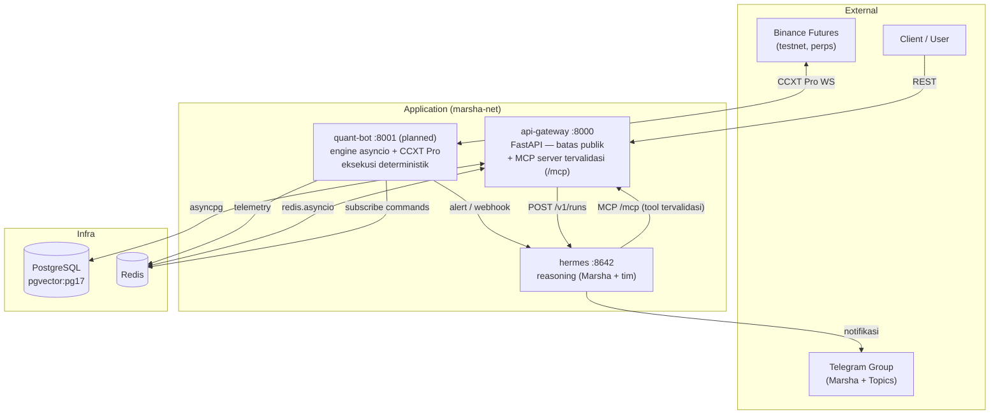

# marsha-agent

Sistem **trading crypto perpetual** berbasis multi-agent. Sebuah tim agent AI (dipimpin **Marsha**) melakukan *reasoning* — analisis, riset, keputusan risiko — sementara sebuah engine deterministik mengeksekusi trade dan menjaga *guardrail*. Pengguna berinteraksi lewat **grup Telegram**, dan dapat berdiskusi dengan Marsha untuk meninjau performa serta menyetujui perubahan konfigurasi.

> **Status:** pengembangan awal — **paper-trading / testnet dulu** (Binance Futures testnet). Modal & eksekusi uang nyata menyusul setelah sistem tervalidasi.

---

## Filosofi Inti

| Prinsip | Artinya |
|---|---|
| **AI berpikir, engine mengeksekusi** | Hermes tidak pernah menekan tombol eksekusi. Ia menghasilkan *keputusan*; `quant-bot` yang deterministik mengeksekusi + meng-*clamp*. |
| **Hitung itu deterministik** | RSI/MACD/PnL dihitung di Python (CCXT/`pandas-ta`), bukan ditebak LLM. LLM hanya menafsir. |
| **Validasi di batas** | Semua tulisan terstruktur lewat tool tervalidasi `api-gateway` (Pydantic), bukan SQL mentah dari LLM. |
| **Dua kunci untuk menambah risiko, satu kunci untuk mengurangi** | Menaikkan risiko butuh persetujuan tim agent **dan** kamu. Menurunkan/STOP bisa unilateral + ada *hard guardrail*. |

---

## Arsitektur Tingkat-Tinggi



Alur keputusan → eksekusi: **Hermes memutuskan** (mis. `ADJUST_RISK`, `HALT_TRADING`, rating) → ditulis ke Redis/channel lewat tool tervalidasi → **`quant-bot` memvalidasi & meng-*clamp*** sebelum menerapkan ke exchange.

---

## Layanan

| Service | Port | Peran |
|---|---|---|
| **api-gateway** | 8000 | FastAPI — antarmuka publik, auth, **penulis tunggal tervalidasi**, dan **MCP server** tool Hermes di `/mcp` |
| **quant-bot** *(planned)* | 8001 | Engine eksekusi deterministik (asyncio + CCXT Pro). **Single-worker**, internal-only |
| **hermes** | 8642 | Orchestrator AI (`nousresearch/hermes-agent`) — Marsha + tim, dikonfigurasi via `config.yaml` + skill Markdown |
| **postgres** | 5432 | Penyimpanan persisten (pgvector:pg17) |
| **redis** | 6379 | Memori bersama + pub/sub |

---

## Stack

- **AI:** Hermes Agent (OpenRouter, **model berbayar bertingkat** — murah untuk analyst, kuat untuk decision layer)
- **Exchange/data:** **CCXT Pro** → WebSocket Binance Futures testnet (data + eksekusi dari satu sumber, gratis; tanpa Polygon/Alpaca)
- **Venue:** crypto **perpetual** (`swap`) di balik `ExecutionVenue` Protocol; Hyperliquid (agent wallet *no-withdraw*) = adapter masa depan
- **Backend:** FastAPI (Python async), asyncpg, redis.asyncio

---

## Quickstart (Dev)

```bash
cp .env.example .env        # isi OPENROUTER_API_KEY, POSTGRES_PASSWORD, API_SECRET_KEY, dst.
docker compose up -d        # jalankan seluruh stack
docker compose logs -f hermes
```

Perintah lengkap (hot-reload, test, rebuild) ada di [`CLAUDE.md`](./CLAUDE.md#dev-commands).

---

## Dokumentasi

Mengikuti struktur [Diátaxis](https://diataxis.fr/):

- **Penjelasan** ([`docs/explanation/`](./docs/explanation/)) — `arsitektur.md`, `multi-agent.md`, `monitoring-dan-alert.md`, `diagrams.md`
- **Keputusan** ([`docs/adr/`](./docs/adr/)) — venue, autonomy & governance, validated-tools/MCP, dll.
- **How-to** ([`docs/how-to/`](./docs/how-to/)) — setup lokal, Telegram, tambah skill, [setup Hermes di Docker](./docs/how-to/hermes-docker.md)
- **Referensi** ([`docs/reference/`](./docs/reference/)) — schema DB, Redis keys, env vars, API endpoints

Aturan engineering & batasan domain: [`CLAUDE.md`](./CLAUDE.md).
