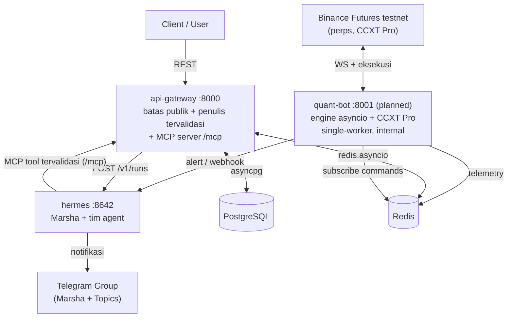

# Arsitektur marsha-agent

## Gambaran Umum

marsha-agent adalah sistem **trading crypto perpetual** multi-agent. Terinspirasi konsep *multi-agent trading firm*: setiap komponen punya tanggung jawab jelas dan tidak tumpang tindih. Prinsip utamanya — **AI berpikir, engine mengeksekusi**.

## Tiga Runtime (jangan tertukar)

Sistem terdiri dari lima service, tapi penting membedakan **tiga jenis runtime**:

| Runtime | Wujud | Ditulis oleh | Trading logic? |
|---|---|---|---|
| `api-gateway` (FastAPI :8000) | aplikasi FastAPI | kita (Python) | ❌ — batas + I/O tervalidasi |
| `quant-bot` (FastAPI :8001, *planned*) | FastAPI + engine asyncio | kita (Python) | ✅ **di sini** |
| `hermes` (:8642) | produk `nousresearch/hermes-agent` | **dikonfigurasi**, bukan ditulis | ❌ — reasoning |

> **Hermes bukan kode FastAPI yang kamu tulis.** Ia produk jadi yang kamu *konfigurasi* lewat `config.yaml` + skill Markdown. Tool-nya datang dari MCP + skill — bukan dari FastAPI. Lihat [ADR-006](../adr/006-api-gateway-mcp-tool-tervalidasi.md).

## Diagram Komponen



### postgres
Penyimpanan persisten: histori trade, log keputusan Hermes, hasil analisis, **konfigurasi trading** (`trading_config`) + audit perubahannya (`config_changes`), dan **insight** hasil refleksi. Ekstensi `pgvector` untuk pencarian vektor di masa depan.

### redis
Memori bersama + pub/sub. Menyimpan telemetri realtime (`state:bot:telemetry`), cache config aktif (`config:active:*`), laporan interim subagent (`analysis:{SYMBOL}:*`), dan channel command/alert.

### hermes
Inti reasoning. **Marsha** = satu agent orchestrator (lihat [multi-agent.md](./multi-agent.md)) yang memimpin tim (analysts → researchers → trader → risk → PM) via `delegate_task`. Tidak ada framework LLM eksternal. Tool tulis Hermes lewat **MCP server tervalidasi `api-gateway`**, bukan SQL mentah.

### api-gateway
Antarmuka publik FastAPI **dan** batas keamanan. Tiga peran: (1) REST publik + auth + agregasi read; (2) **penulis tunggal tervalidasi** (Pydantic) untuk tabel terstruktur; (3) **MCP server** (`/mcp`) yang menyediakan tool tervalidasi untuk Hermes.

### quant-bot *(planned)*
Engine eksekusi **deterministik**. Loop asyncio melahap WebSocket Binance via CCXT Pro, menghitung sinyal, mengeksekusi trade, menulis telemetri, dan menegakkan **hard-guardrail** (clamp leverage, kill-switch drawdown/likuidasi). **Wajib single-worker** (loop trading adalah singleton) — lihat [ADR-002](../adr/002-fastapi-untuk-quant-bot.md). FastAPI di sini hanya shell tipis di atas engine asyncio.

## Boundary Eksekusi (krusial)

**Hermes tidak pernah memanggil exchange.** Ia menghasilkan *keputusan* (`HALT_TRADING`, `ADJUST_RISK`, rating Buy/Sell) yang mengalir via Redis/channel. **`quant-bot` adalah satu-satunya yang mengeksekusi**, dan selalu **memvalidasi + meng-clamp** keputusan LLM sebelum menerapkannya (defense-in-depth). Lihat [ADR-005](../adr/005-autonomy-governance-asimetri-keselamatan.md).

## Alur Utama

### 1. Risk Monitoring & Pemantauan Trade (otomatis)
Cron Hermes (ter-*provision* via bootstrap, bukan manual) membaca `state:bot:telemetry` + trade terakhir, mengevaluasi, lalu MAINTAIN / ADJUST_RISK / HALT_TRADING. Protokol `[SILENT]` menekan notifikasi saat sehat. Detail & jalur event-driven (webhook): [monitoring-dan-alert.md](./monitoring-dan-alert.md).

### 2. Analisis On-demand (dipicu pengguna)
```
Client → POST /analysis/run {symbol}
  → api-gateway tulis baris PENDING (tervalidasi) → job_id
  → api-gateway → POST hermes/v1/runs (async, dapat run_id)
  → Hermes jalankan pipeline (delegate_task): analysts → researchers → trader → risk → PM
  → api-gateway pantau run_id, validasi output (Pydantic), tulis COMPLETED
  → Client poll GET /analysis/{job_id}
```
**`api-gateway` penulis tunggal** `trading_analyses` — Hermes mengembalikan hasil, tidak menulis SQL (lihat [ADR-006](../adr/006-api-gateway-mcp-tool-tervalidasi.md)).

### 3. Alert dari Quant Bot
`quant-bot` mendeteksi anomali → webhook/`POST /v1/runs` ke Hermes → keputusan → Telegram. `quant-bot` juga subscribe `channel:hermes:commands` untuk menerima `HALT_TRADING` (dengan clamp/validasi).

## Prinsip Desain

- **AI berpikir, engine mengeksekusi.** Logika AI hanya di Hermes; eksekusi hanya di `quant-bot`; `api-gateway` = I/O tervalidasi.
- **Hitung deterministik.** RSI/MACD/PnL di Python (CCXT/`pandas-ta`), bukan LLM.
- **Validasi di batas.** Tulisan terstruktur lewat tool tervalidasi `api-gateway`.
- **Redis sebagai papan tulis bersama.** Subagent berbagi konteks via Redis, bukan komunikasi langsung.
- **Failure domain terpisah.** `quant-bot` di container sendiri; masalah pada market loop tidak mematikan `api-gateway`/Hermes.
- **Asimetri keselamatan.** Dua kunci untuk menambah risiko, satu kunci untuk mengurangi ([ADR-005](../adr/005-autonomy-governance-asimetri-keselamatan.md)).

## Lihat Juga
- [multi-agent.md](./multi-agent.md) — topologi Marsha + tim
- [monitoring-dan-alert.md](./monitoring-dan-alert.md) — pemantauan trade
- [diagrams.md](./diagrams.md) — diagram detail
- ADR [004](../adr/004-venue-crypto-perpetual-binance-testnet.md) · [005](../adr/005-autonomy-governance-asimetri-keselamatan.md) · [006](../adr/006-api-gateway-mcp-tool-tervalidasi.md)
