# Diagrams — marsha-agent

Semua diagram sistem untuk diskusi arsitektur. Mencerminkan keputusan terverifikasi (lihat [ADR](../adr/) 001–006). Catatan: `quant-bot` masih **planned**.

---

## 1. Arsitektur Sistem (High-Level)

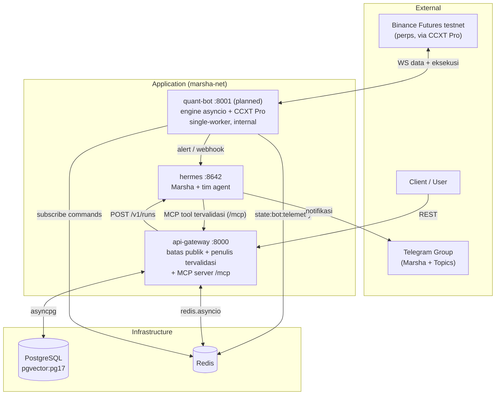

Perubahan kunci vs versi awal: `quant-bot` internal (tak di-publish), Hermes mengakses data **lewat tool tervalidasi `api-gateway` (MCP-over-HTTP)**, sumber data = **WebSocket Binance via CCXT Pro**.

---

## 2. Service Dependencies (Startup Order)

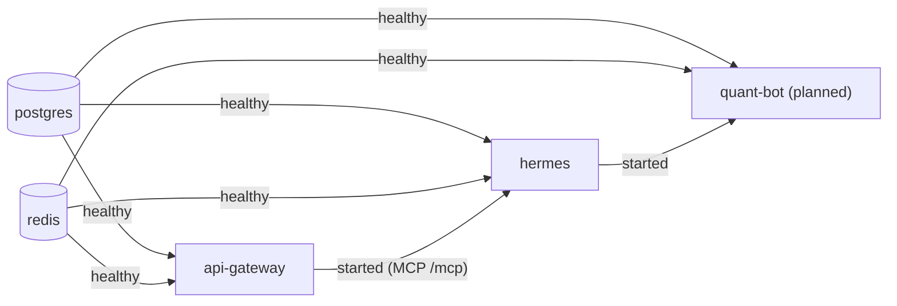

Catatan: Hermes butuh `api-gateway` hidup karena tool tulis-nya disediakan via `/mcp`.

---

## 3. Alur Risk Monitoring (Otomatis, via Cron Bootstrap)

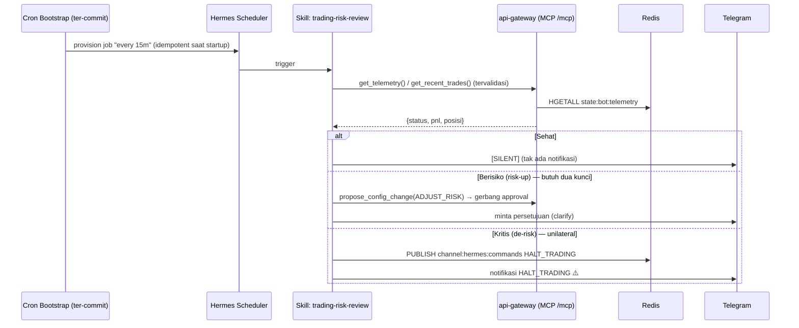

"Hermes Cron" kini eksplisit di-*provision* lewat **bootstrap ter-commit** (bukan dibuat manual). Tulisan/usulan lewat tool tervalidasi; arah keselamatan (HALT) unilateral.

---

## 4. Alur Analisis Multi-Agent On-Demand

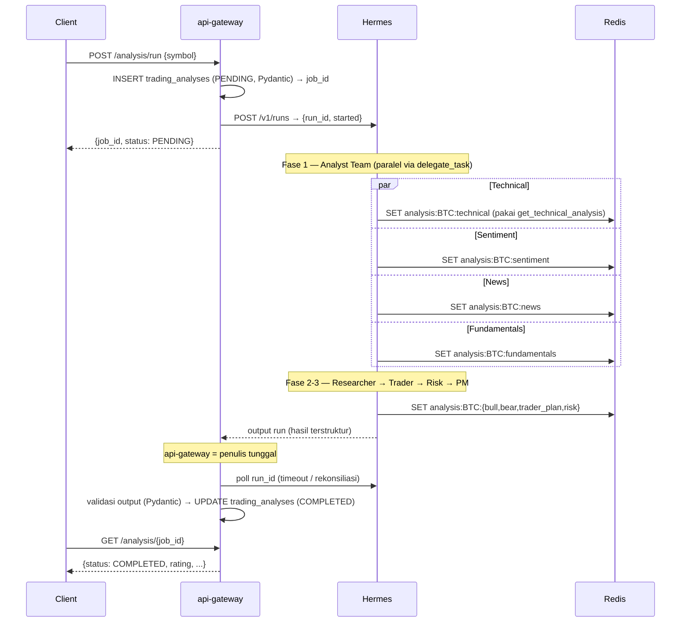

Hermes **mengembalikan** hasil; **`api-gateway` yang menulis** `trading_analyses` setelah validasi. `run_id` dipakai untuk timeout/rekonsiliasi (cegah PENDING menggantung).

---

## 5. Alur Alert dari Quant Bot (dengan Validasi/Clamp + Guardrail Perps)

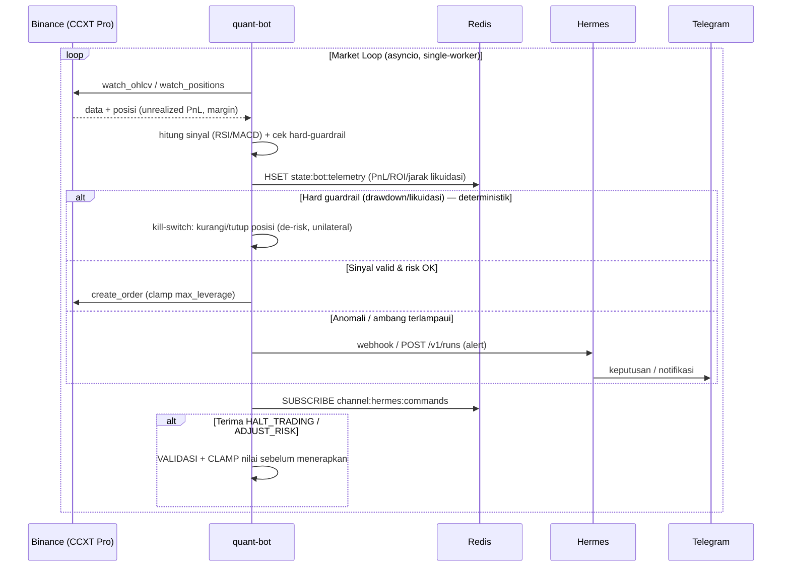

Tambahan vs versi awal: **lapisan validasi/clamp** untuk perintah LLM, dan **hard-guardrail perps** (buffer likuidasi, clamp leverage) yang deterministik.

---

## 6. Komponen Internal Quant Bot (planned)

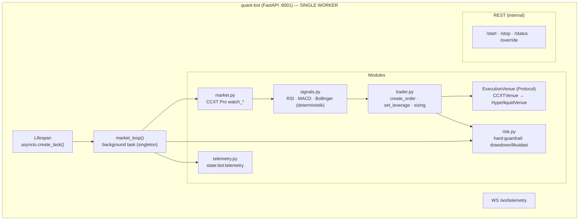

`market.py` pakai CCXT Pro `watch_*`; eksekusi lewat **`ExecutionVenue` Protocol** (Binance dulu, Hyperliquid menyusul). **Wajib single-worker** ([ADR-002](../adr/002-fastapi-untuk-quant-bot.md)).

---

## 7. Database ERD

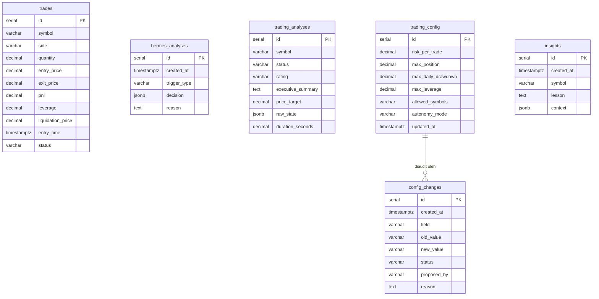

---

## 8. Redis Key Map

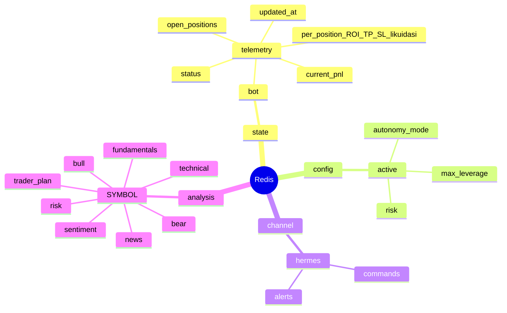

---

## 9. Hermes Skill Pipeline

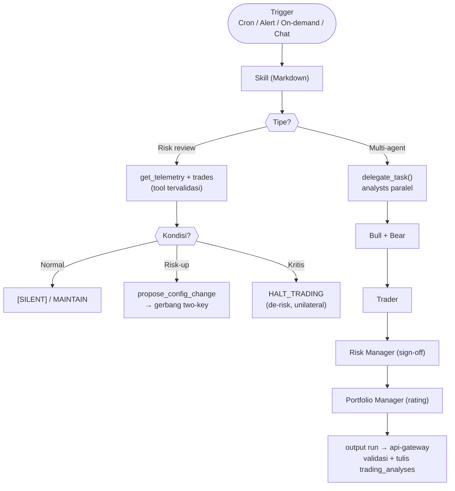

---

## 10. Governance: Two-Key + Asimetri Keselamatan

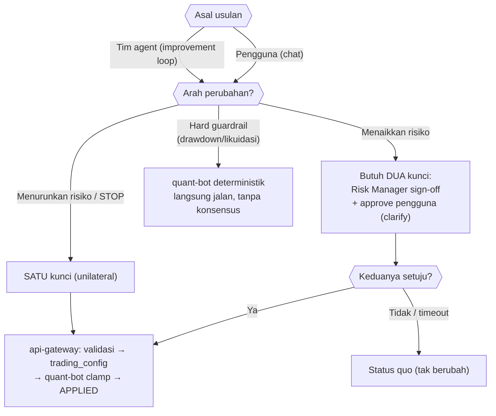

Lihat [ADR-005](../adr/005-autonomy-governance-asimetri-keselamatan.md).

---

## 11. Monitoring & Alert Trade

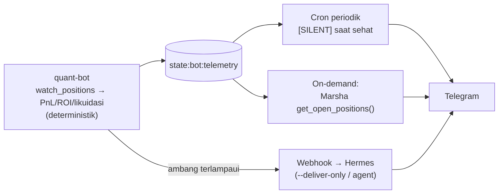

Detail: [monitoring-dan-alert.md](./monitoring-dan-alert.md).
